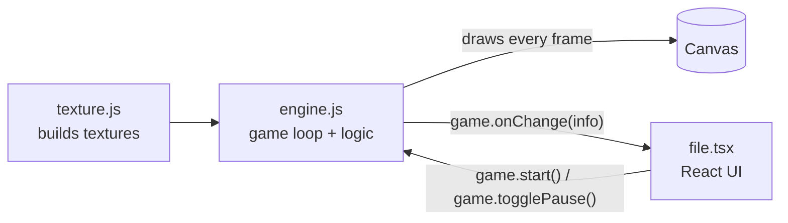
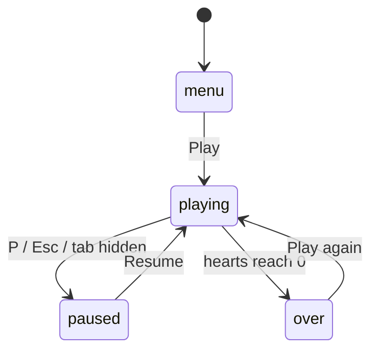

<div align="center">

# 🍎 Fruit Frenzy

**A fast, colorful catch-the-fruit arcade game built with vanilla JavaScript, HTML5 Canvas and React.**

Catch the fruit. Dodge the bombs. Beat your best score.

<br />

[](https://github.io/n17v/fruit-frenzy/)

<br />


</div>

<br />

## ✨ Highlights

- **Zero image files.** Every sprite and the whole background scene are drawn with code.
- **Smooth 60 FPS loop** with delta-time movement, so it feels the same on any screen.
- **Plays anywhere.** Keyboard, mouse and touch controls, with a responsive layout.
- **Gets harder as you play.** Items fall faster and spawn more often as your score grows.
- **Game feel.** Screen shake, damage flash, spinning fruit, floating score popups and drifting clouds.
- **Saves your best score** in the browser with `localStorage`.
- **No build step.** Plain static files that run straight from GitHub Pages.

<br />

## 🎮 How to Play

Move the basket to catch what falls. Lose all 5 hearts and the game is over.

| Item | Name   | Result                       |
| :--: | :----- | :--------------------------- |
|  🍎  | Apple  | **+1** point                 |
|  🍊  | Orange | **+2** points                |
|  🍒  | Cherry | **+5** points, rare          |
|  💣  | Bomb   | **−1 heart** if you catch it |

> [!TIP]
> Missing an apple or an orange also costs a heart, so you can't just hide in a corner. Cherries are free: missing one costs nothing.

### Controls

| Input             | Action                  |
| :---------------- | :---------------------- |
| `←` `→` or `A` `D` | Move the basket        |
| Mouse / Touch     | Basket follows pointer  |
| `P` or `Esc`      | Pause / resume          |
| `Enter` or `Space` | Start / play again     |

The game also pauses on its own when you switch to another tab.

<br />

## 🧱 Tech Stack

| Layer      | Technology                         | Used for                                  |
| :--------- | :--------------------------------- | :---------------------------------------- |
| Game       | Vanilla JavaScript + Canvas 2D     | Game loop, physics, collisions, rendering |
| Artwork    | Canvas drawing API                 | Procedural textures, no image assets      |
| Interface  | React 18 + TypeScript (TSX)        | HUD, menu, pause and game over screens    |
| Styling    | Tailwind CSS (CDN)                 | Layout and UI styling                     |
| Compiling  | Babel Standalone                   | Compiles the TSX file in the browser      |
| Hosting    | GitHub Pages                       | Free static hosting                       |

<br />

## 🗂️ Project Structure

```
fruit-frenzy/
├── index.html          Main page: loads libraries, canvas and scripts
├── js/
│   ├── texture.js      Draws every sprite and the background in code
│   └── engine.js       Game loop, input, spawning, collisions, scoring
├── react/
│   └── file.tsx        React interface layered over the canvas
├── README.md
└── LICENSE
```

| File | Role |
| :--- | :--- |
| **`index.html`** | Loads Tailwind, React, ReactDOM and Babel from CDNs. Creates the `<canvas>` and the `#root` element that sits on top of it, then loads `texture.js`, `engine.js` and `file.tsx` in that order. |
| **`js/texture.js`** | `makeTexture(w, h, draw)` creates an off-screen canvas and runs a drawing function on it. Results are stored in a global `textures` object: `background`, `cloud`, `basket`, `apple`, `orange`, `cherry` and `bomb`. |
| **`js/engine.js`** | The core of the game. Holds the `game` and `player` objects, item types and odds, input, spawning, collisions, lives, high score, effects, drawing and the main loop. Exposes `game.start`, `game.togglePause` and `game.onChange` for the UI. |
| **`react/file.tsx`** | The interface. `Hearts`, `Panel` and `PlayButton` are small components, and `App` shows the right screen for the current game state. |

<br />

## ⚙️ How It Works

### Architecture

The engine owns the game. React only shows the interface and tells the engine when a button is clicked.



### Game states



The loop only runs `update()` while the state is `playing`. Drawing and visual effects keep running in every state, so the menu and game over screens still look alive.

<details>
<summary><b>Main loop</b></summary>

<br />

`requestAnimationFrame` calls `loop(time)` every frame. The time since the last frame (`dt`, capped at 0.05s) is passed to `update()` so movement is measured in pixels per second instead of pixels per frame. Each frame runs `update(dt)` (only while playing), then `updateEffects(dt)`, then `draw()`.

</details>

<details>
<summary><b>Spawning and difficulty</b></summary>

<br />

A timer counts down and spawns one item when it reaches zero. The item type comes from a weighted random roll (apple 45%, orange 25%, bomb 22%, cherry 8%). Fall speed is `150 + score × 3`, capped at 380, plus a small random amount. The delay between spawns shrinks from 1 second down to a minimum of 0.35 seconds as the score grows. The level goes up every 20 points.

</details>

<details>
<summary><b>Collisions</b></summary>

<br />

Each item is checked against the top opening of the basket with a simple rectangle overlap test (AABB). A caught fruit adds points, a caught bomb removes a heart, and an apple or orange that reaches the bottom of the screen also removes a heart.

</details>

<details>
<summary><b>Procedural textures</b></summary>

<br />

At load time each sprite is drawn once onto an off-screen canvas using circles, lines, curves, ellipses and gradients. During the game the engine only calls `drawImage` with those canvases, which is fast and keeps the project free of image files.

</details>

<details>
<summary><b>Engine and React communication</b></summary>

<br />

Whenever the score, hearts or state change, the engine calls `game.onChange` with a plain object. `App` saved a setter function there inside `useEffect`, so every update becomes a React state change and the screen re-renders. Buttons call back into the engine with `game.start()` and `game.togglePause()`. The React layer uses `pointer-events-none` so mouse and touch input still reach the game underneath.

</details>

<br />

## 🚀 Run Locally

The TSX file is loaded with a network request, so opening `index.html` directly from your files will not work. Use any local server:

```bash
npx serve
```

Or open the folder in VS Code and start the **Live Server** extension. Then visit the address it prints, usually `http://localhost:3000`.

<br />

## 🌐 Deploy to GitHub Pages

1. Push the project to a GitHub repository.
2. Go to **Settings → Pages**.
3. Under **Build and deployment**, choose **Deploy from a branch**.
4. Select the `main` branch and the `/ (root)` folder, then click **Save**.
5. After about a minute the game is live at `https://<username>.github.io/<repository>/`.

<br />

## 🛣️ Ideas for Later

- [ ] Sound effects and a mute button
- [ ] Power-ups such as a wider basket or slow motion
- [ ] Combo multiplier for catching fruit in a row
- [ ] Online leaderboard

<br />

## 📦 Third-Party Libraries

React, ReactDOM, Babel Standalone and Tailwind CSS are loaded from CDNs, and the Fredoka font comes from Google Fonts. They keep their own licenses. The license in this repository covers only the original game code and artwork.

<br />

## 📄 License

**Copyright © 2026 n17v. All rights reserved.**

This is a private portfolio project. Only the author may use it commercially, and nobody may copy, publish or modify the code without written permission. See [LICENSE](LICENSE) for the full terms.

<br />

<div align="center">

Made with ❤️ by **n17v**

</div>
